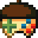

#  **Brux Game Development Kit**

&nbsp;

## **License**

All code is available under the [GNU Affero General Public License v3](https://www.gnu.org/licenses/agpl-3.0.en.html).

### **Introduction**

Brux (formerly known as XYG) is an open-source, cross-platform, runtime-based game development kit using the Squirrel language. The aim is to make development both easy and versatile, allowing games to be written by hand in a simple text editor or made in an IDE similar to Game Maker, and to allow games to be ported with little to no modification to the code, offering a "build once, run everywhere" development process.

Developers using Brux may freely make games without any need for paid license or royalties. Anyone willing to donate may visit my **[Patreon](http://www.patreon.com/kelvin)** or my **[Ko-Fi](http://www.ko-fi.com/kelvinshadewing)**.

Disclosure: The material in this {book/paper/blog/article} has not been reviewed, endorsed, or approved of by the Rust Foundation. For more information on the Rust Foundation Trademark Policy, click here.

If you're viewing from a mirror, the main repo is hosted here: https://codeberg.org/KelvinShadewing/brux-gdk

### Dependencies
#### Runtime

* SDL2
* SDL2_image
* SDL2_mixer
* SDL2_net
* SDL2_gfx
* [Squirrel](http://squirrel-lang.org/)
#### Integrated Development Environment

* Qt5 (>=5.12)
* K Frameworks 5 (>=5.78.0)
### To Do (Runtime)

- [X] Sprite loading and rendering
- [X] Sound loading and playing
- [X] Bitmap monospace text
- [X] Keyboard and mouse input
- [X] Table saving/loading as JSON file
- [ ] Bitmap dynamic text
- [X] FPS management
- [X] Gamepad input
- [X] JSON map loading and rendering
- [ ] Collision geometry (Currently implemented in Squirrel)
- [ ] Chipmunk physics engine
- [ ] Networking (details TBD)

**Fixes needed:**

- [ ] Deleting sprites appears to have a chance of deleting the wrong sprite

### To Do (Editor)

* Everything (I haven't planned everything needed yet. I'll wait until the RE grows some more.)

### Change Log

* **0.2.11**
  * Removed support for `system()` calls (This appears to be built into Squirrel by default and could cause malicious code in game mods)
  * Added `binstr()`
  * Added `windowW()` and `windowH()`
  * Added `setScaling()`
  * Fixed chance of non-string-convertable type being passed incorrectly in `jsonWrite()`
  * Added `choose()`
  * Added pseudo typecasting functions `int()`, `float()`, `str()`, `char()`, and `bool()`
  * Added `getDrawTarget()`

* **0.2.10**
  * Remove std namespace
  * Fix image removal mistake

* **0.2.9**
  * Add volume controls

* **0.2.8**
  * Add mouse wheel detection

* **0.2.7**
  * Fix sprite flipping

* **0.2.6**
  * Fix `replaceSprite()`

* **0.2.5**
  * Add `toggleFullscreen()`
  * Add `inDistance2()`, which skips use of square root for faster distance checking
  * Anything else from 0.2.4, which I forgot to log. :/

* **0.2.3**
  * Add `min()` and `max()` (Yes, Squirrel was missing these in my tests)

* **0.2.2**
  * Add texture and sprite blend modes
  * Add music fadeout
  * Add sound channel controls
  * Fix `pointAngle()` and `lendirX/Y()` math
  * Code cleanup
  * Add version number function

* **0.2.1**
  * Fix frame timer
  * Add `playSoundChannel()`
  * Many changes (I've been terrible at keeping track. Sorry.)

* **0.0.10**
  * Added sprite alpha blending (Why did this take so long?)
  * Removed unnecessary argument from `newSprite()`
  * Fixed FPS limiter for real this time

* **0.0.9**
  * Added functions to get current display dimensions
  * Fixed FPS limiter
  * Added `chint()`, which gets an ascii character from an integer
  * Added `getFrames()`, which returns the number of frames since the game began
  * Added `spriteW/H()`, which returns the dimensions of a sprite
  * Fixed `wrap()`

* **0.0.8**
  * Embed actors.nut into runtime, now feature complete
  * Added polygon-polygon hit detection

* **0.0.7**
  * Added lendirX/Y, equivalent to Game Maker's lengthdir_x/y.
  * Added graphical tilemap per layer rendering

* **0.0.6**
  * Add functions to stop, pause, and check music status
  * Remove TinyXML, using cJSON instead

* **0.0.5**
  * Update `wrap()` to support floats
  * Created std library folder
  * Fixed `findSprite()`, segfault no longer occurs

* **0.0.4**
  * Added basic joystick support
  * Added Xinput mapping for Linux
  * Fixed `getdir()` on Windows
  * `test.nut` features keyboard/mouse (F1) and gamepad (F2) testing modes
  * Added basic geometry rendering
  * Divided reference docs into multiple files
  * Started writing tutorials

* **0.0.3**
  * Added monospace bitmap font support
  * Added support for importing/exporting tables as JSON files

* **0.0.2**
  * Finished framerate cap (framerates between 30 and 300 are distinctly different!)
  * Fixed audio bug where loadMusic() would return a sound index instead of music

* **0.0.1**
  * Added change log
  * Features existing before change log:
    * Keyboard and mouse input
	* Sprite loading and rendering
	* Sound and music
	* Run games by associating .nut and .sq files with Brux
	* Text rendering
